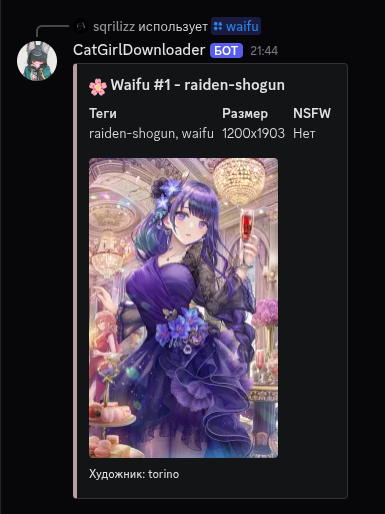

<div align="center">

# CatGirl Discord Bot



**Modern Discord bot for anime pictures with dynamic tag loading**

*Based on [CatgirlDownloader](https://github.com/NyarchLinux/CatgirlDownloader) with improvements and new features*

[](https://python.org)
[](https://discordpy.readthedocs.io/)
[](LICENSE)
[](https://waifu.im)

[Add Bot](#installation) • [Documentation](#commands) • [Setup](#developer-setup)

</div>

---

## Features

**Smart Search** - Autocomplete with popular tag prioritization  
**All API Tags** - Dynamic loading of all available tags from Waifu.im  
**Tag Search** - Find exactly what you're looking for  
**NSFW Support** - Safe access to NSFW content  
**User App** - Works everywhere: servers, DMs, group chats  
**Rate Limiting** - Stable operation without API errors  
**Beautiful UI** - Modern embed messages  
**Auto-update** - Tags update automatically

## Installation

### For Users (Recommended)

**User App** - works everywhere without admin permissions:

```
https://discord.com/api/oauth2/authorize?client_id=YOUR_BOT_ID&scope=applications.commands
```

### For Servers

**Server Bot** - classic method with permissions:

```
https://discord.com/api/oauth2/authorize?client_id=YOUR_BOT_ID&permissions=2147485696&scope=bot%20applications.commands
```

---

## Commands

### Main Commands

| Command | Description | Parameters |
|---------|-------------|------------|
| `/waifu` | Random anime picture | `nsfw`, `tag`, `count` |
| `/nsfw` | NSFW picture | `tag`, `count` |
| `/tags` | Show available tags | `nsfw`, `search` |
| `/help` | Commands help | - |

### Admin Commands

| Command | Description | Access |
|---------|-------------|--------|
| `/reload_tags` | Reload tags from API | Administrators |
| `/sync` | Sync commands | Administrators |

## Features

### What Makes This Bot Special?

- **All tags automatically** - Bot loads ALL available tags from API on startup
- **Smart autocomplete** - Prioritization of popular tags and exact matches
- **Works everywhere** - Servers, DMs, group chats
- **Stable operation** - Automatic API rate limiting handling
- **Modern approach** - User App instead of outdated Server Bot

### Where Does It Work?

**Discord servers** (with NSFW channel checks)  
**Direct messages** (all commands available)  
**Group chats** (all commands available)  
**Mobile devices** (full support)  

---

## Developer Setup

### Requirements

- Python 3.8+
- Discord.py 2.3+
- aiohttp
- python-dotenv

### Quick Start

1. **Clone repository**
```bash
git clone https://github.com/Sqrilizz/CatGirlDiscord.git
cd CatGirlDiscord
```

2. **Install dependencies**
```bash
pip install -r requirements.txt
```

3. **Configure tokens**
```bash
cp .env.example .env
# Edit .env file
```

4. **Run bot**
```bash
python bot.py
# or alternatively
python scripts/run.py
```

### Creating Discord Application

1. Go to [Discord Developer Portal](https://discord.com/developers/applications)
2. Click "New Application" and name your bot
3. Go to "Bot" section in left menu
4. Click "Add Bot"
5. Copy bot token (needed for `.env`)

### Permission Setup

In "OAuth2" → "URL Generator":
1. Select scope: `bot` and `applications.commands`
2. Select Bot Permissions:
   - Send Messages
   - Use Slash Commands
   - Embed Links
   - Attach Files
   - Read Message History

### Install Dependencies

```bash
pip install -r requirements.txt
```

### Environment Setup

1. Copy `.env.example` to `.env`:
```bash
cp .env.example .env
```

2. Edit `.env` file:
```env
DISCORD_TOKEN=your_discord_bot_token
WAIFU_API_TOKEN=j6UBBh8ljk3HTVdz7kPLloZNbqhXOPmpGurtNtMiPs0
```

### Run Bot

```bash
python bot.py
```

## Configuration

### API v5 Update

**Important!** Bot updated for new Waifu.im API v5. Main changes:

- New endpoint: `/images` instead of `/search`
- New response structure with pagination
- Updated tag system
- Improved error handling
- **API token required** (mandatory for v5)

### Project Structure

```
CatGirlDiscord/
├── bot.py              # Main bot file
├── waifu_api.py        # Waifu.im API client
├── config.py           # Configuration
├── requirements.txt    # Dependencies
├── README.md           # Documentation
├── .env.example        # Environment variables example
├── LICENSE             # MIT license
├── Pics/               # Images for README
├── docs/               # Documentation
│   └── CONTRIBUTING.md # Contributor guide
├── tests/              # Tests
│   └── test_api.py     # API tests
└── scripts/            # Scripts
    └── run.py          # Alternative launcher
```

### Environment Variables

| Variable | Description | Required |
|----------|-------------|----------|
| `DISCORD_TOKEN` | Discord bot token | Yes |
| `WAIFU_API_TOKEN` | Waifu.im API v5 token | Yes (for v5) |

**Getting API Token:**
1. Register at [Waifu.im](https://waifu.im)
2. Go to profile settings
3. Create new API token
4. Add token to `.env` file

## Tag System

### Dynamic Loading

Bot automatically loads **ALL** available tags from Waifu.im API:

- Auto-update on bot startup
- Categorization into SFW, NSFW and versatile
- Search by tag name
- Smart suggestions for incorrect input

### Tag Statistics

- **SFW tags**: ~9 categories
- **NSFW tags**: ~7 categories  
- **Total**: 16+ unique tags
- **Update**: Automatic on startup

### Popular Tags

**SFW:**
- `waifu` - Waifu
- `maid` - Maid
- `uniform` - Uniform
- `selfies` - Selfies
- `oppai` - Oppai

**NSFW:**
- `hentai` - Hentai
- `ecchi` - Ecchi
- `ero` - Ero
- `milf` - MILF
- `ass` - Ass

## Security and Privacy

### Content Protection

- **NSFW filtering** - Automatic channel type check
- **Age restrictions** - Discord rules compliance
- **Safe sources** - Only verified Waifu.im API

### Privacy

- **Doesn't read messages** - Only slash commands
- **Doesn't collect data** - No user logging
- **Minimal permissions** - Minimum access rights

---

## Support and Contributing

### Found a Bug?

1. Check [Issues](https://github.com/Sqrilizz/CatGirlDiscord/issues)
2. Create new Issue with detailed description
3. Attach logs and screenshots

### Have an Idea?

1. Discuss in [Discussions](https://github.com/Sqrilizz/CatGirlDiscord/discussions)
2. Create Pull Request
3. Follow [Contributing Guide](docs/CONTRIBUTING.md)

### Like the Project?

Star it on GitHub! It motivates further development.

---

## License

This project is distributed under MIT license. See [LICENSE](LICENSE) for details.

---

<div align="center">

**Made with love for anime community**

*Special thanks to [NyarchLinux](https://github.com/NyarchLinux) for original [CatgirlDownloader](https://github.com/NyarchLinux/CatgirlDownloader)*

[Add Bot](https://discord.com/api/oauth2/authorize?client_id=YOUR_BOT_ID&scope=applications.commands) • [Documentation](docs/CONTRIBUTING.md) • [Bug Report](https://github.com/Sqrilizz/CatGirlDiscord/issues)

</div>
