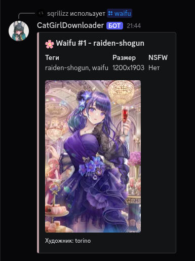

<div align="center">

# 🌸 CatGirl Discord Bot



**Современный Discord бот для получения аниме картинок с динамической загрузкой тегов**

*Создан на базе [CatgirlDownloader](https://github.com/NyarchLinux/CatgirlDownloader) с улучшениями и новыми возможностями*

[](https://python.org)
[](https://discordpy.readthedocs.io/)
[](LICENSE)
[](https://waifu.im)

[🚀 Добавить бота](#-установка-бота) • [📖 Документация](#-команды) • [🛠️ Настройка](#-настройка-для-разработчиков)

</div>

---

## ✨ Основные возможности

🎯 **Умный поиск** - Автодополнение с приоритизацией популярных тегов  
🏷️ **Все теги API** - Динамическая загрузка всех доступных тегов с Waifu.im  
🔍 **Поиск по тегам** - Найдите именно то, что ищете  
🔞 **NSFW поддержка** - Безопасный доступ к NSFW контенту  
📱 **User App** - Работает везде: серверы, DM, групповые чаты  
⚡ **Rate Limiting** - Стабильная работа без ошибок API  
🎨 **Красивый UI** - Современные embed сообщения  
🛠️ **Автообновление** - Теги обновляются автоматически

## 🚀 Установка бота

### Для пользователей (рекомендуется)

**User App** - работает везде без прав администратора:

```
https://discord.com/api/oauth2/authorize?client_id=YOUR_BOT_ID&scope=applications.commands
```

### Для серверов

**Server Bot** - классический способ с разрешениями:

```
https://discord.com/api/oauth2/authorize?client_id=YOUR_BOT_ID&permissions=2147485696&scope=bot%20applications.commands
```

---

## 📋 Команды

### 🎲 Основные команды

| Команда | Описание | Параметры |
|---------|----------|----------|
| `/waifu` | Случайная аниме картинка | `nsfw`, `tag`, `count` |
| `/nsfw` | NSFW картинка | `tag`, `count` |
| `/tags` | Показать доступные теги | `nsfw`, `search` |
| `/help` | Справка по командам | - |

### 🛠️ Админ команды

| Команда | Описание | Доступ |
|---------|----------|--------|
| `/reload_tags` | Обновить теги с API | Администраторы |
| `/sync` | Синхронизировать команды | Администраторы |

## 🎯 Особенности

### 🌟 Что делает этот бот особенным?

- **Все теги автоматически** - Бот загружает ВСЕ доступные теги с API при запуске
- **Умное автодополнение** - Приоритизация популярных тегов и точных совпадений
- **Работает везде** - Серверы, личные сообщения, групповые чаты
- **Стабильная работа** - Автоматическая обработка rate limiting API
- **Современный подход** - User App вместо устаревшего Server Bot

### 📱 Где работает?

✅ **Discord серверы** (с проверкой NSFW каналов)  
✅ **Личные сообщения** (все команды доступны)  
✅ **Групповые чаты** (все команды доступны)  
✅ **Мобильные устройства** (полная поддержка)  

---

## 🛠️ Настройка для разработчиков

### 📋 Требования

- Python 3.8+
- Discord.py 2.3+
- aiohttp
- python-dotenv

### 🚀 Быстрый старт

1. **Клонируйте репозиторий**
```bash
git clone https://github.com/Sqrilizz/CatGirlDiscord.git
cd CatGirlDiscord
```

2. **Установите зависимости**
```bash
pip install -r requirements.txt
```

3. **Настройте токены**
```bash
cp .env.example .env
# Отредактируйте .env файл
```

4. **Протестируйте API (опционально)**
```bash
python tests/test_api.py
```

5. **Запустите бота**
```bash
python bot.py
# или альтернативно
python scripts/run.py
```

### 🔧 Создание Discord приложения

1. Перейдите на [Discord Developer Portal](https://discord.com/developers/applications)
2. Нажмите "New Application" и дайте название вашему боту
3. Перейдите в раздел "Bot" в левом меню
4. Нажмите "Add Bot"
5. Скопируйте токен бота (понадобится для `.env`)

### 2. Настройка разрешений

В разделе "OAuth2" → "URL Generator":
1. Выберите scope: `bot` и `applications.commands`
2. Выберите Bot Permissions:
   - Send Messages
   - Use Slash Commands
   - Embed Links
   - Attach Files
   - Read Message History

### 3. Установка зависимостей

```bash
pip install -r requirements.txt
```

### 4. Настройка окружения

1. Скопируйте `.env.example` в `.env`:
```bash
cp .env.example .env
```

2. Отредактируйте `.env` файл:
```env
DISCORD_TOKEN=ваш_токен_discord_бота
WAIFU_API_TOKEN=ваш_токен_waifu_api  # Опционально
```

### 5. Запуск бота

```bash
python bot.py
```

## ⚙️ Конфигурация

### 📁 Структура проекта

```
CatGirlDiscord/
├── 📄 bot.py              # Основной файл бота
├── 🔧 waifu_api.py        # API клиент Waifu.im
├── ⚙️ config.py           # Конфигурация
├── 📋 requirements.txt    # Зависимости
├── 📖 README.md           # Документация
├── 🔒 .env.example        # Пример переменных
├── 📄 LICENSE             # MIT лицензия
├── 🖼️ Pics/               # Изображения для README
├── 📚 docs/               # Документация
│   └── CONTRIBUTING.md    # Гайд для контрибьюторов
├── 🧪 tests/              # Тесты
│   └── test_api.py        # Тесты API
└── 🚀 scripts/            # Скрипты
    └── run.py             # Альтернативный запуск
```

### 🔐 Переменные окружения

| Переменная | Описание | Обязательно |
|------------|----------|-------------|
| `DISCORD_TOKEN` | Токен Discord бота | ✅ Да |
| `WAIFU_API_TOKEN` | Токен Waifu.im API | ❌ Нет |

## 🏷️ Система тегов

### 🔄 Динамическая загрузка

Бот автоматически загружает **ВСЕ** доступные теги с Waifu.im API:

- 🔄 **Автообновление** при запуске бота
- 🏷️ **Категоризация** на SFW, NSFW и универсальные
- 🔍 **Поиск** по названию тега
- 💡 **Умные подсказки** при неправильном вводе

### 📊 Статистика тегов

- **SFW теги**: ~9 категорий
- **NSFW теги**: ~7 категорий  
- **Всего**: 16+ уникальных тегов
- **Обновление**: Автоматически при запуске

### 🎯 Популярные теги
- `milf` - MILF
- `oral` - Оральный
- `paizuri` - Пайзури
- `ecchi` - Этти
- `ero` - Эротика

## 🔒 Безопасность и конфиденциальность

### 🛡️ Защита контента

- ✅ **NSFW фильтрация** - Автоматическая проверка типа канала
- ✅ **Возрастные ограничения** - Соблюдение правил Discord
- ✅ **Безопасные источники** - Только проверенное API Waifu.im

### 🔐 Конфиденциальность

- ❌ **Не читает сообщения** - Только slash команды
- ❌ **Не собирает данные** - Никакого логирования пользователей
- ❌ **Не требует разрешений** - Минимальные права доступа

---

## 🤝 Поддержка и вклад

### 🐛 Нашли баг?

1. Проверьте [Issues](https://github.com/Sqrilizz/CatGirlDiscord/issues)
2. Создайте новый Issue с подробным описанием
3. Приложите логи и скриншоты

### 💡 Есть идея?

1. Обсудите в [Discussions](https://github.com/Sqrilizz/CatGirlDiscord/discussions)
2. Создайте Pull Request
3. Следуйте [Contributing Guide](docs/CONTRIBUTING.md)

### ⭐ Понравился проект?

Поставьте звезду на GitHub! Это мотивирует на дальнейшую разработку.

---

## 📄 Лицензия

Этот проект распространяется под лицензией MIT. См. [LICENSE](LICENSE) для подробностей.

---

<div align="center">

**Сделано с ❤️ для аниме сообщества**

*Особая благодарность [NyarchLinux](https://github.com/NyarchLinux) за оригинальный [CatgirlDownloader](https://github.com/NyarchLinux/CatgirlDownloader)*

[🌸 Добавить бота](https://discord.com/api/oauth2/authorize?client_id=YOUR_BOT_ID&scope=applications.commands) • [📖 Документация](docs/CONTRIBUTING.md) • [🐛 Баг репорт](https://github.com/Sqrilizz/CatGirlDiscord/issues)

</div>


